# Agent Framework 架构图

```mermaid
flowchart LR
    User["用户"] --> CLI["app/cli.py<br/>命令行交互层"]
    User --> Browser["浏览器<br/>app/web_static Web UI"]
    Browser --> WebApp["app/web.py<br/>FastAPI / WebSocket"]

    CLI --> Memory["memory_messages<br/>短期会话记忆"]
    CLI --> Graph["LangGraph StateGraph<br/>AgentState"]
    WebApp --> Memory
    WebApp --> Graph
    WebApp --> WebState["Web 会话状态<br/>status / model_output / tool_runs / events / world_state"]
    WebState -->|"WS /ws 实时推送"| Browser

    subgraph State["AgentState"]
        Messages["messages<br/>Human / AI / Tool messages"]
        Revision["revision_count<br/>质检重试次数"]
        EvalStatus["eval_status<br/>PASS / REJECT"]
        Session["session_id<br/>会话隔离标识"]
        Complexity["task_complexity<br/>simple / complex / unknown"]
        Tags["context_tags<br/>动态上下文标签"]
        World["world_state<br/>已固化事实 / todo / 工具摘要"]
        LastNode["last_node<br/>上一节点来源"]
        Todo["todo_list<br/>分级任务清单"]
        Next["orchestrator_next<br/>agent / evaluate"]
    end

    Graph --> State

    subgraph Runtime["运行时编排"]
        Orchestrator["orchestrator_node<br/>任务拆解 / todo 更新 / context_tags"]
        Agent["agent_reasoning_node<br/>Agent Brain"]
        MemoryManager["memory_manager_node<br/>固化 World State / 早期归档"]
        RouteMemory{"route_after_memory<br/>按 last_node 与消息类型路由"}
        ToolsNode["tools_execution_node<br/>逐个 tool_call 调用工具子图"]
        ToolSubgraph["tool_execution_subgraph<br/>execute / fix / finalize"]
        Evaluator["evaluate_response_node<br/>QA Evaluator"]
        RouterEval{"route_after_evaluation<br/>质检是否通过"}
    end

    Graph --> Orchestrator
    Orchestrator --> MemoryManager
    Agent --> MemoryManager
    ToolsNode --> MemoryManager
    MemoryManager --> RouteMemory
    RouteMemory -->|"继续行动"| Agent
    RouteMemory -->|"有 tool_calls"| ToolsNode
    RouteMemory -->|"工具完成 / 需重编排"| Orchestrator
    RouteMemory -->|"最终答复待质检"| Evaluator
    ToolsNode --> ToolSubgraph
    Evaluator --> RouterEval
    RouterEval -->|"PASS"| Final["最终回答"]
    RouterEval -->|"REJECT"| Orchestrator
    Final --> CLI
    Final --> WebApp
    CLI --> User
    WebApp --> Browser

    subgraph ToolFlow["工具执行子图"]
        Execute["execute<br/>执行单个工具"]
        Fix["fix<br/>LLM 参数修复"]
        Finalize["finalize<br/>最终结果 / 外部动作提示"]
        Execute -->|"success / terminal / needs_external_action"| Finalize
        Execute -->|"retryable_failure 且未超预算"| Fix
        Fix -->|"retrying"| Execute
        Fix -->|"declined / invalid / parse error"| Finalize
    end

    ToolSubgraph --> Execute

    subgraph Config["配置与提示词"]
        Env[".env<br/>LLM_PROVIDER / MODEL / API_KEY / TAVILY_API_KEY"]
        Prompts["config/prompts.yaml<br/>global_context / orchestrator / agent_brain / evaluator / tool_execution / tools"]
        Claude["CLAUDE.md<br/>可按 [context_tag] 分段"]
        Notes[".data/global/agent_memory.json<br/>带 tags 的 Agent Notes"]
        Logging["config/logging.yaml<br/>日志等级与格式"]
    end

    Env --> ConfigPy["app/config.py<br/>初始化 LLM / Tavily / State / Callback"]
    Prompts --> ConfigPy
    Claude --> PromptBuilder["app/nodes/common.py<br/>get_system_prompt"]
    Notes --> PromptBuilder
    Logging --> Logger["app/logging_config.py<br/>统一日志"]
    PromptBuilder --> Orchestrator
    PromptBuilder --> Agent
    PromptBuilder --> Evaluator
    ConfigPy --> Orchestrator
    ConfigPy --> Agent
    ConfigPy --> Evaluator
    Logger --> Orchestrator
    Logger --> Agent
    Logger --> ToolsNode
    Logger --> Evaluator

    subgraph Tools["app/tools/registry.py 工具层"]
        Search["search_web<br/>联网检索"]
        Python["run_python<br/>Python 计算与数据处理"]
        Command["run_command<br/>系统命令执行"]
    end

    Execute --> Search
    Execute --> Python
    Execute --> Command

    subgraph External["外部依赖"]
        LLM["OpenAI-compatible LLM<br/>OpenAI / DeepSeek / Ollama / llama.cpp"]
        Tavily["Tavily Search API"]
        Shell["本机 Shell<br/>注意：当前不是系统级沙箱"]
    end

    Agent --> LLM
    Orchestrator --> LLM
    Evaluator --> LLM
    Fix --> LLM
    Search --> Tavily
    Command --> Shell
```



## 图例说明

这是一个基于 LangGraph 与工具调用的循环执行框架，整体架构分为“命令行/浏览器入口、状态图、运行时节点、工具执行子图、动态上下文/记忆层、配置层、外部依赖”七部分。

- `app/cli.py` 是命令行入口，负责接收用户输入，维护 `memory_messages`，构建 LangGraph 图，并驱动执行。
- `build_agent_graph()` 在 `app/cli.py` 中创建 `StateGraph(AgentState)`，注册 `orchestrator`、`agent`、`tools`、`memory`、`evaluate` 五个节点。
- `orchestrator_node` 负责判断任务复杂度、生成和更新分级 `todo_list`，并输出动态 `context_tags`。
- `memory_manager_node` 是图内记忆分流节点，负责把确认过的任务状态、工具结果摘要和最终答复固化到 `world_state`，并在已固化信息足够时提前归档冗余消息。
- `agent_reasoning_node` 是核心大脑节点，注入当前 `todo_list`、`world_state`、动态上下文标签和 `agent_brain` 提示词，通过绑定了工具的模型执行推理。
- `tools_execution_node` 不再直接使用 LangGraph 预置 `ToolNode`，而是逐个 tool call 调用私有 `tool_execution_subgraph`，只把最终 `ToolMessage` 返回父图。
- `tool_execution_subgraph` 负责单个工具调用的执行、失败分类、有限重试、LLM 参数修复、安全校验和最终结果归一化。`run_python` 缺少依赖时会返回 `needs_external_action`，不会在子图内自动调用 `run_command` 安装依赖。
- `evaluate_response_node` 负责最终质量检查，`PASS` 则结束，`REJECT` 则将状态回退给 `orchestrator` 重试。
- `app/config.py` 读取 `.env` 与 `config/prompts.yaml`，初始化 LLM 客户端、Tavily 搜索客户端、状态类型和回调。
- `app/web.py` 提供 Web UI，复用同一个图引擎，并通过 WebSocket 实时推送模型输出、工具运行、节点事件、todo 和 `world_state` 变化。

## 运行链路

1. 用户输入被追加到 `memory_messages`。
2. 构建初始 `AgentState`：
   - `messages`
   - `revision_count`
   - `eval_status`
   - `session_id`
   - `task_complexity`
   - `todo_list`
   - `context_tags`
   - `world_state`
   - `orchestrator_next`
3. `StateGraph` 从 `START` 进入 `orchestrator`。
4. `Orchestrator` 根据当前消息、`todo_list`、近期上下文和模型结果更新任务状态，并输出 `context_tags` 与 `orchestrator_next`。
5. `MemoryManager` 接收 Orchestrator 输出，固化 `world_state`，再根据 `last_node`、`orchestrator_next` 和最后一条消息路由到 `agent` 或 `evaluate`。
6. `Agent` 基于动态系统提示词、`todo_list` 和 `world_state` 生成模型响应：
   - 若包含 `tool_calls`，`MemoryManager` 路由到 `tools`；
   - 若不包含工具调用，`MemoryManager` 路由回 `orchestrator` 更新 todo 并决定是否质检。
7. `Tools` 对每个 tool call 调用工具执行子图，父图只接收最终 `ToolMessage`，再经 `MemoryManager` 固化工具结果并回到 `orchestrator`。
8. `Evaluator` 检查最终回答，`PASS` 输出，`REJECT` 加 `revision_count` 并回到 `orchestrator`。

## 状态模型

在 `app/config.py` 中定义：

```python
class AgentState(TypedDict):
    messages: Annotated[list, add_messages]
    revision_count: int
    eval_status: str
    session_id: NotRequired[str]
    task_complexity: NotRequired[str]
    todo_list: NotRequired[list[dict[str, Any]]]
    context_tags: NotRequired[list[str]]
    world_state: NotRequired[dict[str, Any]]
    last_node: NotRequired[str]
    orchestrator_next: NotRequired[str]
    orchestrator_think: NotRequired[str]
    orchestrator_message: NotRequired[str]
    orchestrator_prompt: NotRequired[list[dict[str, str]]]
```

字段说明：

- `messages`：LangGraph 对话消息列表，使用 `add_messages` 自动累积新消息；MemoryManager 可通过 `RemoveMessage` 提前清理已固化的冗余历史。
- `revision_count`：Evaluator 打回重做次数。
- `eval_status`：当前质量检查结果，`PASS` 或 `REJECT`。
- `session_id`：会话隔离标识，用于数据存储与事件隔离。
- `task_complexity`：任务复杂度，`simple`、`complex` 或 `unknown`。
- `todo_list`：复杂任务的分级 todo list，每项包含 `id`、`title`、`status`、`note`、`children`。
- `context_tags`：Orchestrator 识别出的动态上下文标签，用于按需加载静态规则和 Agent Notes。
- `world_state`：MemoryManager 固化的世界状态板，保存当前任务进度、工具结果摘要、动态标签和最终答复摘要。
- `last_node`：最近一次产生状态更新的节点，用于 MemoryManager 正确路由。
- `orchestrator_next`：Orchestrator 决定的下一步节点，`agent` 或 `evaluate`。
- `orchestrator_think`：Orchestrator 大模型决策时的思考过程（`<think>` 标签内容）。
- `orchestrator_message`：Orchestrator 决策输出的原始 JSON 结果（去除了思考过程）。
- `orchestrator_prompt`：Orchestrator 运行时的上下文提示词与输入。

## 模块职责

### app/cli.py

- 构造 `StateGraph` 并注入 `MemorySaver()` checkpointer。
- 注册 `orchestrator`、`agent`、`tools`、`memory`、`evaluate` 五个节点。
- 将 Orchestrator、Agent、Tools 的输出统一汇入 MemoryManager 后再路由。
- 提供命令行交互：`/clear` 清空记忆并重置线程 ID，`/quit` 退出。
- 将用户输入封装为 `HumanMessage`，追加到 `memory_messages`。
- 发送最终 AI 响应回记忆列表。

### app/config.py

- 读取 `config/prompts.yaml` 和环境变量。
- 根据 `LLM_PROVIDER` 初始化 `ChatOpenAI`：
  - `openai`
  - `deepseek`
  - `ollama`
  - `llamacpp`
  - 其他 OpenAI 兼容服务
- 初始化 `TavilyClient` 和 `llm_client`。
- 定义 `AgentState`，包括 `messages`、`todo_list`、`context_tags`、`world_state` 和 `last_node`。
- 提供 `StreamingConsoleCallback`，支持命令行流式输出。

### app/memory/store.py

- 提供 `trim_messages()`、`archive_messages()` 和工具结果归档能力。
- 提供 `normalize_context_tags()` 与 `infer_context_tags()`，用于动态上下文标签标准化和启发式推断。
- 支持按 `[tag]` 分段加载 `CLAUDE.md`，避免每轮把全部静态规则注入系统提示词。
- 支持按 `tags` 过滤 `agent_memory.json` 中的 Agent Notes。

### app/nodes/

- `orchestrator_node`：
  - 基于 `orchestrator` 提示词分析 `todo_list`、任务复杂度、动态 `context_tags` 与路由。
  - 返回 `task_complexity`、`todo_list`、`context_tags`、`orchestrator_next` 和 `last_node`。
  - 在解析失败时使用保守路由。
- `memory_manager_node`：
  - 构建紧凑 `world_state`。
  - 在结构化状态已固化后，提前归档并移除冗余早期消息。
  - 通过 `route_after_memory()` 统一处理 Orchestrator、Agent、Tools 后续路由。
- `agent_reasoning_node`：
  - 将 `agent_brain` 提示、动态上下文标签、`todo_list` 和 `world_state` 拼接。
  - 使用绑定工具的模型进行推理。
  - 返回 AI 消息并标记 `last_node = "agent"`。
- `tools_execution_node`：
  - 解析最后一条 AI 消息中的 `tool_calls`。
  - 对每个 tool call 调用 `tool_execution_subgraph`。
  - 返回与原始 `tool_call_id` 对应的干净 `ToolMessage` 列表。
- `evaluate_response_node`：
  - 对最终回答与当前 `todo_list` / `world_state` 进行质量检查。
  - 当 `revision_count >= 3` 时触发熔断，避免无限重试。

### app/nodes/tool_execution_subgraph.py

- 定义单个工具调用的私有 `ToolExecutionState`。
- `execute`：执行工具、分类结果，并记录内部执行上下文。
- `fix`：仅在可修复参数错误时调用 LLM 生成 JSON 参数修复，并做 schema 与安全校验。
- `finalize`：统一生成父图可见的最终工具结果。
- 对 `run_command` 修复参数做危险命令和风险升级拦截。
- 对 `run_python` 的 `ModuleNotFoundError` / 依赖型 `ImportError` 返回 `needs_external_action`，建议由主图决定是否在隔离环境中安装依赖；子图不会自行跨工具调用 `run_command`。

### app/tools/

当前工具集：

- `search_web(query)`：通过 Tavily 查询最新网络信息。
- `run_python(code)`：执行 Python 代码并返回 stdout。
- `run_command(command)`：执行 shell 命令并返回 stdout/stderr。

注意：当前 `run_python` 与 `run_command` 不是系统级沙箱执行；如果要允许安装依赖或修改环境，应先引入真正的隔离执行层。

### app/web.py

- `ConsoleSession` 管理 `thread_id`、`memory_messages`、`running_task` 和 `state` 快照。
- `WebConsoleCallback` 实时推送：模型输出、工具调用、节点更新。
- 会话状态包含 `context_tags` 和 `world_state`，MemoryManager 输出会同步到 Web state。
- 提供 HTTP 与 WebSocket 接口：
  - `GET /api/state`
  - `POST /api/chat`
  - `POST /api/stop`
  - `POST /api/clear`
  - `WS /ws`

## 提示词与策略

`config/prompts.yaml` 定义：

- `global_context`：全局上下文信息，如当前时间。
- `orchestrator`：任务拆解、todo 生成、动态 `context_tags` 与路由逻辑。
- `agent_brain`：大脑节点行为准则，优先执行 todo。
- `evaluator`：质检判断标准。
- `tool_execution.fix_args`：工具子图参数修复器提示词，只允许修复当前工具参数。
- `tools`：工具自然语言说明。

`CLAUDE.md` 和 Agent Notes 的注入是按需的：

- `CLAUDE.md` 可在标题或独立行使用 `[file_system]`、`[api_call]`、`[python]` 等标签。
- Agent Notes 保存时会记录 `tags`。
- `get_system_prompt(..., context_tags=...)` 只加载与当前标签匹配的规则和笔记。

## 关键设计点

- `StateGraph` 实现可复用的“有状态循环工作流”。
- `Orchestrator` 保持 `todo_list` 持续演进，而非一次性规划。
- `MemoryManager` 将“当前状态是什么”固化到 `world_state`，让 `messages` 更专注于“发生了什么”。
- `MemoryManager` 可在信息已固化后提前归档冗余历史，而不是等待上下文达到最大尺寸。
- `context_tags` 控制静态规则和 Agent Notes 的按需加载，降低系统提示词膨胀风险。
- `Agent Brain` 负责行动，不负责最终质量判定。
- 工具执行子图隔离内部 retry/fix 上下文，父图只接收最终 `ToolMessage`。
- `run_python` 缺依赖被视为外部动作需求，而不是子图内部跨工具安装。
- `Evaluator` 防止模型提前给出不完整的“已完成”回复。
- Web UI 通过 `WebSocket` 实时同步内部状态，便于可视化。

## 启动方式

- 终端模式：
  ```bash
  source .venv/bin/activate
  ./run_cli.sh
  ```
- Web UI 模式：
  ```bash
  source .venv/bin/activate
  ./run_web.sh
  ```
