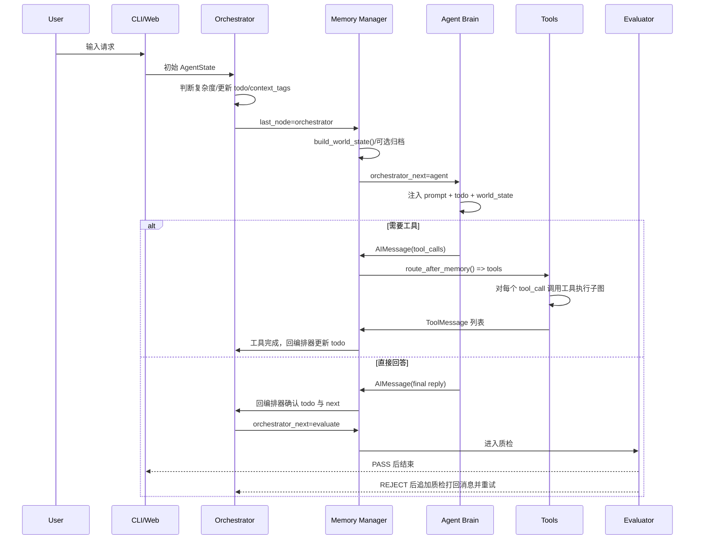

# Agent Framework 架构说明

本文是项目架构总入口。更细的模块设计见：

- [Agent Brain 设计说明](docs/modules/brain.md)
- [Orchestrator 设计说明](docs/modules/orchestrator.md)
- [路由与状态图设计说明](docs/modules/routing.md)
- [Memory Manager 设计说明](docs/modules/memory-manager.md)
- [Tools 与工具执行子图设计说明](docs/modules/tools.md)
- [Skill Mechanism 技能机制设计说明](docs/modules/skills.md)
- [Evaluator 设计说明](docs/modules/evaluator.md)
- [入口、配置与运行期模块说明](docs/modules/runtime-and-entrypoints.md)
- [开发者上手指南](docs/development.md)
- [新增工具指南](docs/how-to-add-tool.md)
- [状态字段与消息协议](docs/state-and-message-contract.md)
- [测试策略](docs/testing.md)

## 1. 项目定位

这是一个基于 LangGraph、LangChain Tool Calling 和 OpenAI-compatible Chat API 的 Agent 框架。它把一次用户请求拆成“编排、记忆固化、大脑推理、工具执行、质量检查”几个可观察节点，通过循环状态图完成复杂任务。

设计目标不是做一个单轮问答壳，而是让 Agent 在较长任务里持续维护：

- 当前任务是否复杂。
- 复杂任务的分级 todo。
- 已确认事实、工具结果摘要和最终答复摘要。
- 工具调用失败后的修复与安全边界。
- 最终回答是否真正满足 todo 与用户问题。

典型例子：用户要求“分析项目结构并更新文档”。Orchestrator 会先把任务拆成读取结构、理解模块、更新架构文档、验证四类子任务；Agent Brain 根据 todo 决定读文件或写文档；Tools 执行命令；Memory Manager 固化发现；Evaluator 检查回答是否遗漏“更新文档”这个结果。

## 2. 模块总图

```mermaid
flowchart TB
    User["用户"] --> CLI["CLI<br/>app/cli.py"]
    User --> WebUI["Web UI<br/>app/web_static/"]
    WebUI --> Web["FastAPI/WebSocket<br/>app/web.py"]

    CLI --> Graph["LangGraph StateGraph<br/>build_agent_graph()"]
    Web --> Graph

    subgraph State["AgentState"]
        Messages["messages<br/>Human/AI/Tool"]
        Todo["todo_list<br/>分级任务计划"]
        Tags["context_tags<br/>动态上下文标签"]
        ActiveSkills["active_skills<br/>已加载技能名称"]
        World["world_state<br/>已固化事实板"]
        Eval["eval_status/revision_count"]
        Debug["orchestrator/evaluator<br/>think/message/prompt"]
        Route["last_node/orchestrator_next"]
        Session["session_id"]
    end

    Graph --> State

    subgraph Nodes["app/nodes/ 运行时节点"]
        O["Orchestrator<br/>任务拆解/更新 todo/决策下一步"]
        M["Memory Manager<br/>固化 world_state/归档历史/统一路由"]
        A["Agent Brain<br/>LLM 推理/生成 tool_calls/最终答复"]
        T["Tools Node<br/>逐个执行 tool_call"]
        E["Evaluator<br/>最终 QA/打回重做"]
    end

    Graph --> O
    O --> M
    M --> A
    A --> M
    M --> T
    T --> M
    M --> E
    E -->|"PASS"| Done["END"]
    E -->|"REJECT"| O
    M -->|"工具完成或阶段答复"| O

    subgraph ToolSubgraph["单个工具调用子图"]
        X["execute<br/>执行工具并分类结果"]
        F["fix<br/>LLM 修复参数"]
        Z["finalize<br/>归一化 ToolMessage 内容"]
        X -->|"retryable_failure"| F
        F -->|"retrying"| X
        X -->|"success/terminal/needs_external_action"| Z
        F -->|"declined/invalid"| Z
    end

    T --> ToolSubgraph

    subgraph Tools["app/tools/ 工具层"]
        Search["search_web<br/>Tavily 搜索"]
        Python["run_python<br/>Python exec 计算"]
        Command["run_command<br/>shell 命令"]
        API Request["api_request<br/>API 请求工具"]
        SkillTools["save/list/get/delete_skill_sop<br/>技能管理"]
        Storage["storage/context<br/>会话隔离与结果归档"]
    end

    X --> Search
    X --> Python
    X --> Command
    X --> API Request
    X --> SkillTools
    Search --> Storage
    Python --> Storage
    Command --> Storage
    API Request --> Storage
    SkillTools --> Storage

    subgraph Context["上下文与配置"]
        Prompts["config/prompts.yaml"]
        Guidelines["STATIC_GUIDELINES.md<br/>按 [tag] 懒加载"]
        Notes[".data/global/agent_memory.json<br/>Agent Notes"]
        Skills["skills/*.md<br/>按 [tags] 动态加载"]
        Runtime[".data/sessions/{session_id}/"]
        Config["app/config.py<br/>LLM/Tavily/AgentState"]
    end

    Prompts --> Config
    Guidelines --> A
    Guidelines --> O
    Notes --> A
    Notes --> O
    Skills --> A
    Storage --> Runtime
```

## 3. 目录结构

```text
.
├── app/
│   ├── cli.py                         # CLI 入口与 LangGraph 组装
│   ├── web.py                         # FastAPI/WebSocket 控制台
│   ├── config.py                      # 环境变量、提示词、LLM、AgentState
│   ├── runtime_paths.py               # 运行期路径约定
│   ├── logging_config.py              # 日志配置
│   ├── nodes/
│   │   ├── orchestrator.py            # 编排器
│   │   ├── agent.py                   # Agent Brain
│   │   ├── memory_manager.py          # world_state 与路由枢纽
│   │   ├── tools_node.py              # 父图工具节点
│   │   ├── tool_execution_subgraph.py # 单工具调用私有子图
│   │   ├── evaluator.py               # QA 质检器
│   │   └── common.py                  # prompt、todo、JSON、tag 公共函数
│   ├── memory/
│   │   └── store.py                   # 历史压缩、归档、静态规则和 Agent Notes
│   ├── tools/
│   │   ├── registry.py                # AGENT_TOOLS 注册表
│   │   ├── search.py                  # search_web
│   │   ├── python_runner.py           # run_python
│   │   ├── command_runner.py          # run_command
│   │   ├── api_request.py                    # api_request (API 请求工具)
│   │   ├── sandbox.py                 # Docker 沙箱执行引擎
│   │   ├── sandbox_tools.py           # start_sandbox / stop_sandbox / status
│   │   ├── skills.py                  # save_skill_sop / list_skills
│   │   ├── context.py                 # ContextVar session_id
│   │   └── storage.py                 # 工具结果按会话存档
│   └── web_static/                    # 浏览器控制台前端
├── config/
│   ├── prompts.yaml                   # 各节点提示词与工具描述
│   └── logging.yaml
├── skills/                            # 技能 SOP 库 (Markdown)
├── tests/                             # Memory、工具子图、动态上下文测试
├── docs/modules/                      # 模块设计说明
├── STATIC_GUIDELINES.md               # 可按 [context_tag] 分段的静态规则
├── README.md
├── run_cli.sh
└── run_web.sh
```

## 4. 核心运行链路



关键设计点：

- 所有主节点输出先经过 Memory Manager。这样 `world_state` 与路由判断集中在一个地方，不让 Orchestrator、Agent、Tools 各自猜下一跳。
- Orchestrator 的 `next` 会被代码二次校正。只有“最后一条消息是无 tool_calls 的 AIMessage”时才允许进入 Evaluator，避免新用户消息或工具结果被错误质检。
- Tools Node 不直接暴露内部修复过程给父图，只返回与原始 `tool_call_id` 对齐的 `ToolMessage`。内部失败分类、重试、参数修复都在私有子图里完成。
- Evaluator 失败会追加一条 `[质检打回]` 的 `HumanMessage`，让主循环把失败原因当作新约束重新规划。

## 5. 状态模型

`AgentState` 定义在 `app/config.py`：

```python
class AgentState(TypedDict):
    messages: Annotated[list, add_messages]
    revision_count: int
    eval_status: str
    session_id: NotRequired[str]
    task_complexity: NotRequired[str]
    todo_list: NotRequired[list[dict[str, Any]]]
    context_tags: NotRequired[list[str]]
    active_skills: NotRequired[list[str]]
    world_state: NotRequired[dict[str, Any]]
    last_node: NotRequired[str]
    orchestrator_next: NotRequired[str]
    orchestrator_think: NotRequired[str]
    orchestrator_message: NotRequired[str]
    orchestrator_prompt: NotRequired[list[dict[str, str]]]
    evaluator_think: NotRequired[str]
    evaluator_message: NotRequired[str]
    evaluator_prompt: NotRequired[list[dict[str, str]]]
```

| 字段 | 设计意图 |
| --- | --- |
| `messages` | LangGraph 消息流，是 LLM 与工具协议的事实来源。使用 `add_messages` 追加，Memory Manager 可用 `RemoveMessage` 清理。 |
| `revision_count` | Evaluator 打回次数，达到 3 次后熔断通过，避免无限循环。 |
| `eval_status` | 质检结果，主要是 `PASS` / `REJECT`。 |
| `session_id` | CLI/Web/多浏览器会话隔离，工具结果和归档写入 `.data/sessions/{session_id}/`。 |
| `task_complexity` | Orchestrator 对任务复杂度的结构化判断。 |
| `todo_list` | 复杂任务的分级任务计划，支撑可观察进度和 Evaluator 检查。 |
| `context_tags` | 动态上下文标签，用来懒加载 `STATIC_GUIDELINES.md` 片段和 Agent Notes。 |
| `active_skills` | 已注入 Agent Brain 的技能名称列表，用于 Web 可观察性和调试。 |
| `world_state` | Memory Manager 维护的压缩事实板，用于抵抗长上下文丢失。 |
| `last_node` | Memory Manager 路由依据，解决“同样是 AIMessage，不同来源含义不同”的问题。 |
| `orchestrator_next` | Orchestrator 期望下一步，代码层仍会做安全校正。 |
| `orchestrator_think/message/prompt` | Web 调试与可观察性字段，记录编排器提示词、思考摘要和原始输出。 |
| `evaluator_think/message/prompt` | Web 调试与可观察性字段，记录质检器提示词、思考摘要和原始输出。 |

## 6. 设计取舍

### 6.1 为什么要有 Orchestrator

如果只用 ReAct Agent，模型容易在复杂任务里一边调用工具一边忘记原始目标。Orchestrator 把“任务管理”从“执行推理”里拆出来：它不执行工具，只维护复杂度、todo、标签和下一跳。

例如“调研三个方案并写报告”不能让 Agent 查到第一条信息就总结。todo 可以保留“三个方案都要覆盖”的约束，Evaluator 也能据此打回遗漏项。

### 6.2 为什么要有 Memory Manager

长会话里，原始消息越多越贵，也越容易超过上下文窗口。Memory Manager 先把结构化事实固化进 `world_state`，再归档早期冗余消息。这样后续节点看到的是“近期消息 + 压缩事实板”，而不是完整历史流水账。

### 6.3 为什么工具执行要有子图

工具错误分几类：参数可修复、配置不可修复、缺依赖需用户/主图确认、危险命令不能自动升级。把这些逻辑放在 `tool_execution_subgraph` 内，可以让父图继续保持简单：父图只关心最后的 `ToolMessage`。

### 6.4 为什么要有 Evaluator

Agent 最终回答不一定等于任务完成。Evaluator 是一个收口节点，用 todo、最近上下文和草稿回答做宏观 QA。它不会执行任务，只判断是否应该接受或打回。

## 7. 测试覆盖

当前测试集中验证了三条架构边界：

- `tests/test_memory_manager.py`：`world_state` 是否捕获 todo 和工具结果、是否只在状态已固化后归档、路由是否依赖 `last_node`。
- `tests/test_tool_execution_subgraph.py`：工具子图是否保留私有内部历史、是否按 `tool_call_id` 返回父图消息、缺依赖是否交给主图、安全命令修复是否被拒绝。
- `tests/test_dynamic_context.py`：`STATIC_GUIDELINES.md` 和 Agent Notes 是否按 `context_tags` 懒加载。
- `tests/test_skills.py`：技能 SOP 是否按标签加载进系统提示词，以及技能管理工具是否能创建、列出、读取和删除 SOP。
- `tests/test_api_request.py`：`api_request` 工具是否通过沙箱 Python requests 发起 API 请求、拒绝非法 HTTP 方法，并把失败摘要固化为 Agent Note。

这些测试对应项目的主要稳定性边界：状态不能乱跳、上下文不能无限膨胀、工具自动修复不能扩大风险。
