# Agent Framework 架构图

```mermaid
flowchart LR
    User["用户<br/>终端输入"] --> CLI["main.py<br/>命令行交互层"]

    CLI --> Memory["memory_messages<br/>短期会话记忆"]
    CLI --> Graph["LangGraph StateGraph<br/>AgentState"]

    subgraph State["AgentState"]
        Messages["messages<br/>Human / AI / Tool messages"]
        Revision["revision_count<br/>质检重试次数"]
        EvalStatus["eval_status<br/>PASS / REJECT"]
        Complexity["task_complexity<br/>simple / complex"]
        Todo["todo_list<br/>分级任务清单"]
        Next["orchestrator_next<br/>agent / evaluate"]
    end

    Graph --> State

    subgraph Runtime["运行时编排"]
        Orchestrator["orchestrator_node<br/>判断复杂度 / 生成与更新 todo"]
        Agent["agent_reasoning_node<br/>Agent Brain"]
        Router1{"should_continue<br/>是否有 tool_calls"}
        ToolNode["tools_execution_node<br/>LangGraph ToolNode"]
        Evaluator["evaluate_response_node<br/>QA Evaluator"]
        Router2{"route_after_evaluation<br/>质检是否通过"}
    end

    Graph --> Orchestrator
    Orchestrator -->|"next = agent"| Agent
    Orchestrator -->|"next = evaluate"| Evaluator
    Agent --> Router1
    Router1 -->|"有 tool_calls"| ToolNode
    ToolNode -->|"工具结果回填 messages"| Orchestrator
    Router1 -->|"无 tool_calls"| Orchestrator
    Evaluator --> Router2
    Router2 -->|"PASS"| Final["最终回答"]
    Router2 -->|"REJECT"| Orchestrator
    Final --> CLI
    CLI --> User

    subgraph Config["配置与提示词"]
        Env[".env<br/>LLM_PROVIDER / MODEL / API_KEY / TAVILY_API_KEY"]
        Prompts["prompts.yaml<br/>global_context / agent_brain / evaluator / tools"]
        Logging["logging.yaml<br/>日志等级与格式"]
    end

    Env --> ConfigPy["config.py<br/>初始化 LLM / Tavily / State / Callback"]
    Prompts --> ConfigPy
    Logging --> Logger["logger.py<br/>统一日志"]
    ConfigPy --> Orchestrator
    ConfigPy --> Agent
    ConfigPy --> Evaluator
    Logger --> Orchestrator
    Logger --> Agent
    Logger --> ToolNode
    Logger --> Evaluator

    subgraph Tools["tools.py 工具层"]
        Search["search_web<br/>联网检索"]
        Python["run_python<br/>Python 计算与数据处理"]
        Command["run_command<br/>系统命令执行"]
    end

    ToolNode --> Search
    ToolNode --> Python
    ToolNode --> Command

    subgraph External["外部依赖"]
        LLM["OpenAI-compatible LLM<br/>OpenAI / DeepSeek / Ollama / llama.cpp"]
        Tavily["Tavily Search API"]
        Shell["本机 Shell"]
    end

    Agent --> LLM
    Orchestrator --> LLM
    Evaluator --> LLM
    Search --> Tavily
    Command --> Shell

    subgraph Data["本地数据"]
        TSLA["TSLA_12month_daily.csv"]
        WTI["WTI_Crude_Oil_12month_daily.csv"]
        Brent["Brent_Crude_Oil_12month_daily.csv"]
    end

    Python -. "可读取分析" .-> Data
    Command -. "可读取文件" .-> Data
```

## 图例说明

- `main.py` 是命令行入口，负责接收用户输入、维护短期记忆、调用 LangGraph。
- `Orchestrator` 负责判断任务复杂度、生成分级 todo list、根据工具结果和最终回答实时更新 todo，并决定下一步进入 Agent 还是 Evaluator。
- `Agent Brain` 会根据 Orchestrator 提供的 todo list 判断下一步行动，决定是否直接回答或调用工具。
- `ToolNode` 根据模型生成的 tool call 自动执行 `tools.py` 中的工具。
- `Evaluator` 负责最终质量检查，不通过会回到 `Orchestrator` 重新规划。
- `.env`、`prompts.yaml`、`logging.yaml` 分别控制模型配置、提示词策略和日志输出。
- CSV 数据当前没有专用数据工具，主要通过 `run_python` 或 `run_command` 间接访问。
