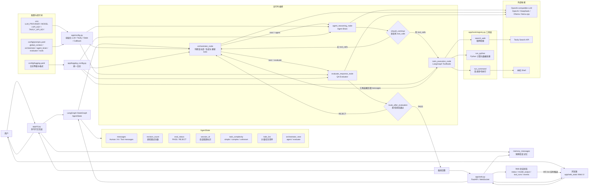

# Agent Framework 架构图



## 图例说明

这是一个基于 LangGraph 与工具调用的循环执行框架，整体架构分为“命令行/浏览器入口、状态图、运行时节点、工具层、配置层、外部依赖”六部分。

- `app/cli.py` 是命令行入口，负责接收用户输入，维护 `memory_messages`，构建 LangGraph 图，并驱动执行。
- `build_agent_graph()` 在 `app/cli.py` 中创建 `StateGraph(AgentState)`，注册 `orchestrator`、`agent`、`tools`、`evaluate` 四个节点。
- `orchestrator_node` 负责判断任务复杂度、生成和更新分级 `todo_list`，并决定下一步进入 `agent` 或 `evaluate`。
- `agent_reasoning_node` 是核心大脑节点，注入当前 `todo_list` 和 `agent_brain` 提示词，通过绑定了工具的模型执行推理。
- `tools_execution_node` 使用 LangGraph 的 `ToolNode`，自动解析模型输出中的 `tool_calls` 并执行 `app/tools/` 中定义的工具函数。
- `evaluate_response_node` 负责最终质量检查，`PASS` 则结束，`REJECT` 则将状态回退给 `orchestrator` 重试。
- `app/config.py` 读取 `.env` 与 `config/prompts.yaml`，初始化 LLM 客户端、Tavily 搜索客户端、状态类型和回调。
- `app/web.py` 提供 Web UI，复用同一个图引擎，并通过 WebSocket 实时推送模型输出、工具运行、节点事件和 todo 变化。

## 运行链路

1. 用户输入被追加到 `memory_messages`。
2. 构建初始 `AgentState`：
   - `messages`
   - `revision_count`
   - `eval_status`
   - `task_complexity`
   - `todo_list`
   - `orchestrator_next`
3. `StateGraph` 从 `START` 进入 `orchestrator`。
4. `Orchestrator` 根据当前消息、`todo_list` 和模型结果判断路由。
5. `Agent` 生成模型响应：
   - 若包含 `tool_calls`，则进入 `tools` 节点；
   - 若不包含工具调用，则回到 `orchestrator`，由 Orchestrator 决定是否进入 `evaluate`。
6. `Tools` 执行后结果写回 `messages`，再返回 `orchestrator`。
7. `Evaluator` 检查最终回答，`PASS` 输出，`REJECT` 加 `revision_count` 并回到 `orchestrator`。

## 状态模型

在 `app/config.py` 中定义：

```python
class AgentState(TypedDict):
    messages: Annotated[list, add_messages]
    revision_count: int
    eval_status: str
    task_complexity: NotRequired[str]
    todo_list: NotRequired[list[dict[str, Any]]]
    orchestrator_next: NotRequired[str]
```

字段说明：

- `messages`：LangGraph 对话消息列表，使用 `add_messages` 自动累积新消息。
- `revision_count`：Evaluator 打回重做次数。
- `eval_status`：当前质量检查结果，`PASS` 或 `REJECT`。
- `task_complexity`：任务复杂度，`simple`、`complex` 或 `unknown`。
- `todo_list`：复杂任务的分级 todo list，每项包含 `id`、`title`、`status`、`note`、`children`。
- `orchestrator_next`：Orchestrator 决定的下一步节点，`agent` 或 `evaluate`。

## 模块职责

### app/cli.py

- 构造 `StateGraph` 并注入 `MemorySaver()` checkpointer。
- 提供命令行交互：`/clear` 清空记忆并重置线程 ID，`/quit` 退出。
- 将用户输入封装为 `HumanMessage`，追加到 `memory_messages`。
- 发送最终 AI 响应回记忆列表。

### app/config.py

- 读取 `config/prompts.yaml` 和环境变量。
- 根据 `LLM_PROVIDER` 初始化 `ChatOpenAI`：
  - `openai`
  - `deepseek`
  - `ollama`
  - `llamacpp`
  - 其他 OpenAI 兼容服务
- 初始化 `TavilyClient` 和 `llm_client`。
- 提供 `StreamingConsoleCallback`，支持命令行流式输出。

### app/nodes/

- `orchestrator_node`：
  - 基于 `orchestrator` 提示词分析 `todo_list`、任务复杂度与路由。
  - 返回 JSON：`task_complexity`、`todo_list`、`next`。
  - 在解析失败时使用保守路由。
- `agent_reasoning_node`：
  - 将 `agent_brain` 提示与当前 `todo_list` 拼接。
  - 使用绑定工具的模型进行推理。
- `evaluate_response_node`：
  - 对最终回答与当前 `todo_list` 进行质量检查。
  - 当 `revision_count >= 3` 时触发熔断，避免无限重试。

### app/tools/

当前工具集：

- `search_web(query)`：通过 Tavily 查询最新网络信息。
- `run_python(code)`：执行 Python 代码并返回 stdout。
- `run_command(command)`：执行 shell 命令并返回 stdout/stderr。

### app/web.py

- `ConsoleSession` 管理 `thread_id`、`memory_messages`、`running_task` 和 `state` 快照。
- `WebConsoleCallback` 实时推送：模型输出、工具调用、节点更新。
- 提供 HTTP 与 WebSocket 接口：
  - `GET /api/state`
  - `POST /api/chat`
  - `POST /api/stop`
  - `POST /api/clear`
  - `WS /ws`

## 提示词与策略

`config/prompts.yaml` 定义：

- `global_context`：全局上下文信息，如当前时间。
- `orchestrator`：任务拆解、todo 生成与路由逻辑。
- `agent_brain`：大脑节点行为准则，优先执行 todo。
- `evaluator`：质检判断标准。
- `tools`：工具自然语言说明。

## 关键设计点

- `StateGraph` 实现可复用的“有状态循环工作流”。
- `Orchestrator` 保持 `todo_list` 持续演进，而非一次性规划。
- `Agent Brain` 负责行动，不负责最终质量判定。
- `ToolNode` 是模型与实际工具执行之间的桥梁。
- `Evaluator` 防止模型提前给出不完整的“已完成”回复。
- Web UI 通过 `WebSocket` 实时同步内部状态，便于可视化。

## 启动方式

- 终端模式：
  ```bash
  source .venv/bin/activate
  ./run_cli.sh
  ```
- Web UI 模式：
  ```bash
  source .venv/bin/activate
  ./run_web.sh
  ```
