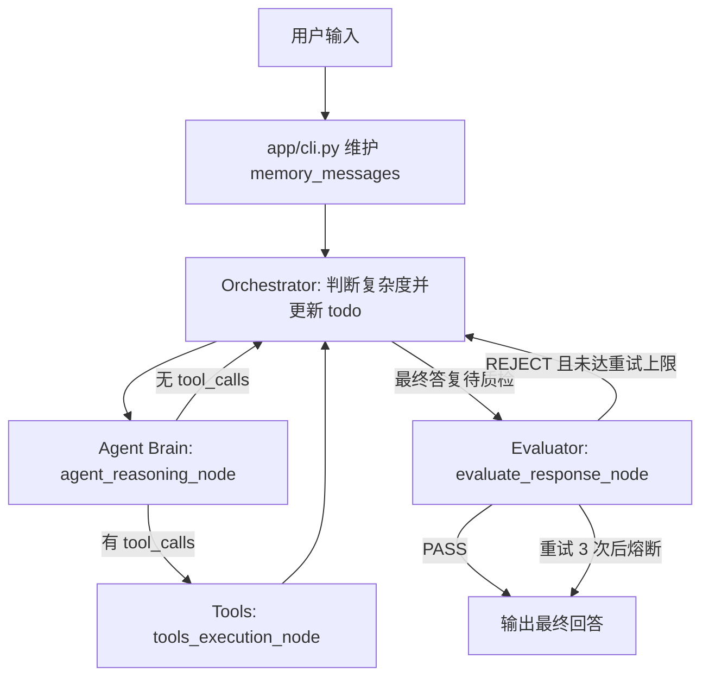

# Agent Framework 架构说明

这是一个基于 LangGraph 和 LangChain Tool Calling 的命令行智能体框架。它把用户输入、LLM 推理、工具调用、结果质检和短期对话记忆组织成一个可循环的状态图，适合用于企业内部查询、数据处理、联网检索和命令行自动化等场景。

## 1. 总体架构

系统由 5 个核心部分组成：

| 层级 | 文件 | 职责 |
| --- | --- | --- |
| CLI 入口 | `app/cli.py` | 启动命令行交互，组装 LangGraph 状态图，维护会话记忆和线程 ID |
| Web UI | `app/web.py` / `app/web_static/` | 提供浏览器对话界面、停止任务、todo 进度、模型输出和 tool 运行状态 |
| 节点逻辑 | `app/nodes/` | 定义 Orchestrator、Agent Brain、ToolNode、Evaluator 四类节点 |
| 工具层 | `app/tools/` | 定义可被大模型调用的工具函数，例如搜索、Python 执行、命令执行 |
| 配置层 | `app/config.py` | 加载 `.env` 和 `config/prompts.yaml`，初始化 LLM、搜索客户端、状态结构和流式回调 |
| 日志层 | `app/logging_config.py` / `config/logging.yaml` | 统一控制台日志格式、日志等级和输出目标 |
| 运行期数据 | `app/runtime_paths.py` / `.data/` | 统一管理全局记忆、会话归档、工具输出和 Web 事件日志 |

运行时，用户在终端输入问题，系统把问题加入 `AgentState.messages`，再交给 LangGraph 状态图驱动。Orchestrator 会先判断任务复杂度；如果是复杂任务，会生成支持分级的 `todo_list`。Agent Brain 后续会带着 todo 上下文推理和行动。工具执行后先回到 Orchestrator 更新 todo 状态，再继续交给 Agent Brain。最终回答会进入 Evaluator 节点做质量检查，不通过则回到 Orchestrator 重新规划。

为了控制长会话上下文，系统已实现：
- `app/memory/store.py` 的 `trim_messages()` 会自动压缩早期对话并保留最近窗口。
- 根目录 `CLAUDE.md` 支持静态规则注入，每次对话开启都会被加载为系统提示。
- 自动记忆笔记会把工具失败或大输出的教训写入本地 `agent_memory.json`，并在后续对话中作为参考加载。
- Web 会话数据按 `session_id` 隔离到 `.data/sessions/{session_id}/`，包括 `conversation_archive.json`、`tool_results.json` 和 `events.jsonl`。

## 2. 运行链路



关键设计点：

- `app/cli.py` 中的 `build_agent_graph()` 是图编排入口。
- `START -> orchestrator` 表示每轮用户输入都先进入编排节点。
- Orchestrator 判断 `simple` / `complex`，复杂任务生成分级 todo list。
- `should_continue()` 根据最后一条 LLM 消息是否包含 `tool_calls` 决定下一步。
- 工具执行完成后固定回到 `orchestrator`，先根据工具结果更新 todo，再让 Agent Brain 继续行动。
- Agent Brain 没有继续调用工具时，也会先回到 Orchestrator 更新 todo，然后进入 Evaluator。
- `evaluate_response_node()` 会检查最终答复是否敷衍、缺少数据、没有完成调研或 todo 仍未完成。
- 质检失败会追加一条 `[质检打回]` 消息，让 Orchestrator 和 Agent Brain 重新规划下一步。
- `revision_count` 达到 3 后熔断，避免无限循环。

## 3. 状态模型

状态结构定义在 `app/config.py`：

```python
class AgentState(TypedDict):
    messages: Annotated[list, add_messages]
    revision_count: int
    eval_status: str
    session_id: NotRequired[str]
    task_complexity: NotRequired[str]
    todo_list: NotRequired[list[dict[str, Any]]]
    orchestrator_next: NotRequired[str]
    orchestrator_think: NotRequired[str]
    orchestrator_message: NotRequired[str]
    orchestrator_prompt: NotRequired[list[dict[str, str]]]
```

字段说明：

| 字段 | 含义 |
| --- | --- |
| `messages` | LangGraph 对话消息列表，使用 `add_messages` 自动累积新消息 |
| `revision_count` | Evaluator 打回重做的次数 |
| `eval_status` | 当前质检状态，主要取值为 `PASS` 或 `REJECT` |
| `session_id` | 会话标识，用于隔离对话归档、工具输出和 Web 事件日志 |
| `task_complexity` | Orchestrator 判断出的任务复杂度，通常是 `simple` 或 `complex` |
| `todo_list` | 复杂任务的分级 todo list，每项包含 `id`、`title`、`status`、`note`、`children` |
| `orchestrator_next` | Orchestrator 决定的下一节点，取值为 `agent` 或 `evaluate` |
| `orchestrator_think` | Orchestrator 大模型决策时的思考过程（`<think>` 标签内容） |
| `orchestrator_message` | Orchestrator 决策输出的原始 JSON 结果（去除了思考过程） |
| `orchestrator_prompt` | Orchestrator 运行时的上下文提示词与输入（系统提示 + 任务背景） |

`app/cli.py` 额外维护了一个 `memory_messages` 列表，作为命令行会话层面的短期记忆。用户输入会追加为 `HumanMessage`，最终回答会追加回该列表，下一轮继续带入上下文。

`/clear` 命令会清空 `memory_messages`，并生成新的 `thread_id`。`thread_id` 传给 LangGraph 的 `MemorySaver`，用于区分不同会话线程。

## 4. 模块职责

### 4.1 `app/cli.py`

主要职责：

- 创建 LangGraph `StateGraph(AgentState)`。
- 注册四个节点：`orchestrator`、`agent`、`tools`、`evaluate`。
- 定义条件路由：
  - `orchestrator -> agent`：需要继续思考或行动。
  - `orchestrator -> evaluate`：Agent 已给出自然语言答复，进入最终质检。
  - `agent -> tools`：模型生成了工具调用。
  - `agent -> orchestrator`：模型没有工具调用，先更新 todo 再决定是否质检。
  - `tools -> orchestrator`：工具完成后，更新 todo 并继续推进。
  - `evaluate -> END`：质检通过。
  - `evaluate -> orchestrator`：质检不通过，重新编排。
- 提供交互式命令：
  - `/quit`、`/exit`、`/q`：退出。
  - `/clear`：清空会话记忆并更换线程 ID。

### 4.2 `app/nodes/`

主要包含四个节点：

| 节点 | 实现 | 作用 |
| --- | --- | --- |
| Orchestrator | `orchestrator_node()` | 判断任务复杂度，生成和实时更新分级 todo list，决定下一步流向 |
| Agent Brain | `agent_reasoning_node()` | 加载系统提示词，把工具绑定到 LLM，生成回答或 tool call |
| Tools | `tools_execution_node = ToolNode(AGENT_TOOLS)` | 自动解析并执行模型请求的工具 |
| Evaluator | `evaluate_response_node()` | 对最终回答做宏观 QA 检查，不合格时打回重做 |

`get_system_prompt()` 会把 `config/prompts.yaml` 中的 `global_context` 和具体节点提示词合并，并注入当前时间。Agent Brain 的系统提示词会额外拼接 Orchestrator 当前维护的 todo 快照。

### 4.3 `app/tools/`

当前工具集为：

| 工具 | 用途 |
| --- | --- |
| `search_web(query)` | 通过 Tavily 做联网检索，返回最多 3 条结果摘要 |
| `run_python(code)` | 在当前 Python 进程中执行代码，用于计算和数据处理 |
| `run_command(command)` | 调用系统 shell 执行命令，返回 stdout / stderr |

工具描述来自 `config/prompts.yaml` 的 `tools` 配置。因为描述会直接影响模型何时调用工具，所以新增工具时要同时维护代码和提示词。

### 4.4 `app/web.py` 和 `app/web_static/`

Web UI 是一个轻量 FastAPI 应用，复用同一个 LangGraph agent：

- `GET /`：加载浏览器控制台页面。
- `GET /api/state`：返回当前会话快照。
- `POST /api/chat`：提交一条用户消息并启动 agent 任务。
- `POST /api/stop`：取消当前正在运行的任务。
- `POST /api/clear`：清空当前 Web 会话状态。
- `WS /ws`：实时推送状态快照和运行事件。

前端三栏布局：

- 左侧：对话历史和输入框。
- 中间：模型流式输出、节点事件时间线。
- 右侧：分级 todo 状态、当前节点、复杂度、tool 调用状态和结果。

### 4.5 `app/config.py`

主要职责：

- 读取 `.env`。
- 读取 `config/prompts.yaml`。
- 定义 `AgentState`。
- 定义 `StreamingConsoleCallback`，用于流式展示模型输出。
- 根据 `LLM_PROVIDER` 初始化 OpenAI 兼容接口的 `ChatOpenAI`。
- 初始化 Tavily 搜索客户端。

支持的 LLM provider：

| Provider | 默认行为 |
| --- | --- |
| `openai` | 使用 `OPENAI_API_KEY` 或 `LLM_API_KEY`，可配置 `LLM_BASE_URL` |
| `deepseek` | 默认 base url 为 `https://api.deepseek.com/v1` |
| `ollama` | 默认 base url 为 `http://localhost:11434/v1` |
| `llamacpp` | 默认 base url 为 `http://localhost:8080/v1` |
| 其他值 | 使用 `LLM_API_KEY` 和可选 `LLM_BASE_URL` 作为 OpenAI 兼容服务 |

### 4.6 `config/prompts.yaml`

提示词分为三类：

- `global_context`：全局上下文，目前注入当前系统时间。
- `orchestrator`：任务复杂度判断、分级 todo 生成、todo 状态更新和路由决策规则。
- `agent_brain`：大脑节点的行为准则，重点约束其按照 Orchestrator 的 todo list 推进任务。
- `evaluator`：质检节点的判断标准。
- `tools`：每个工具的自然语言描述。

## 5. 配置说明

`.env` 中涉及的变量包括：

| 变量 | 说明 |
| --- | --- |
| `LLM_PROVIDER` | 模型供应商，例如 `openai`、`deepseek`、`ollama`、`llamacpp` |
| `LLM_MODEL_NAME` | 模型名称 |
| `LLM_API_KEY` | 通用模型 API Key |
| `LLM_BASE_URL` | OpenAI 兼容接口地址，可选 |
| `LLM_TEMPERATURE` | 模型温度，默认 `0.1` |
| `MAX_CONTEXT_SIZE_BYTES` | 最大序列化对话上下文尺寸，单位 bytes；默认 `524288`，配置值超过 `524288` 会被限制为 512KB |
| `TAVILY_API_KEY` | Tavily 搜索 API Key |

不要把真实 `.env` 提交到公开仓库。当前仓库中 `.gitignore` 已忽略 `.env` 和 `.venv`。

## 6. 运行期目录结构

源码和运行期数据分离：

```text
.
├── run_cli.sh
├── run_web.sh
├── app/
│   ├── cli.py
│   ├── web.py
│   ├── nodes/
│   │   ├── orchestrator.py
│   │   ├── agent.py
│   │   ├── evaluator.py
│   │   ├── tools_node.py
│   │   └── common.py
│   ├── config.py
│   ├── logging_config.py
│   ├── runtime_paths.py
│   ├── memory/
│   │   └── store.py
│   ├── tools/
│   │   ├── registry.py
│   │   ├── search.py
│   │   ├── python_runner.py
│   │   ├── command_runner.py
│   │   ├── context.py
│   │   └── storage.py
│   └── web_static/
│       ├── index.html
│       ├── app.js
│       └── styles.css
├── config/
│   ├── prompts.yaml
│   └── logging.yaml
└── .data/
    ├── global/
    │   └── agent_memory.json
    └── sessions/
        └── {session_id}/
            ├── conversation_archive.json
            ├── tool_results.json
            └── events.jsonl
```

约定：

- `.data/global/` 保存跨会话共享的 Agent 记忆。
- `.data/sessions/{session_id}/conversation_archive.json` 保存该会话被裁剪归档的早期消息。
- `.data/sessions/{session_id}/tool_results.json` 保存该会话的工具输出。短输出仍会返回给模型，但也会记录到这里；长输出返回引用和摘要。
- `.data/sessions/{session_id}/events.jsonl` 保存 Web 控制台事件日志。
- 根目录不再生成 `conversation_archive.json`、`tool_results.json`、`uvicorn.log`。

## 7. 启动方式

首次安装依赖（任选其一）：

```bash
uv venv
uv pip install -r requirements.txt
```

或使用标准 venv/pip：

```bash
python -m venv .venv
.venv/bin/pip install -r requirements.txt
```

命令行模式：

```bash
./run_cli.sh
```

Web UI 模式：

```bash
./run_web.sh
```

`run_cli.sh` 和 `run_web.sh` 会优先使用已激活的虚拟环境，其次使用项目内 `.venv`，最后在安装了 `uv` 时回退到 `uv run --with-requirements requirements.txt`。

然后在浏览器打开 `http://127.0.0.1:8000`。

## 8. 如何扩展一个新工具

新增工具通常需要三步：

1. 在 `app/tools/` 中新增 `@tool` 函数。
2. 在 `config/prompts.yaml` 的 `tools` 下新增同名描述。
3. 在 `app/tools/registry.py` 把工具加入 `AGENT_TOOLS` 列表。

示例结构：

```python
@tool(description=PROMPTS["tools"]["new_tool"])
async def new_tool(arg: str) -> str:
    ...

AGENT_TOOLS = [
    search_web,
    run_python,
    run_command,
    new_tool,
]
```

工具描述要写清楚：

- 什么时候应该调用。
- 什么时候不应该调用。
- 参数含义。
- 同义词和业务黑话。
- 返回结果的边界和可信度。

## 8. 当前风险点和改进建议

| 风险点 | 说明 | 建议 |
| --- | --- | --- |
| `run_python` 使用 `exec()` | 在当前进程执行任意 Python 代码，权限较大 | 增加沙箱、超时、白名单模块和文件访问限制 |
| `run_command` 使用 `shell=True` | 可以执行任意系统命令 | 增加命令白名单、危险命令拦截和审计日志 |
| `.venv` 来自压缩包 | 当前 `.venv` 里包含 Windows 风格路径和 `.exe/.pyd` 文件，在 macOS 上可能不可用 | 在 macOS 本地重新创建虚拟环境并安装依赖 |
| 缺少依赖清单 | 没有 `requirements.txt` 或 `pyproject.toml` | 补充依赖文件，保证环境可复现 |
| Evaluator 只做文本判断 | 质检结果依赖另一次 LLM 判断，可能误判 | 为关键业务引入确定性校验，例如工具调用结果是否存在、todo 是否全部完成 |
| 搜索结果较少 | `search_web` 只返回 3 条摘要 | 根据任务类型支持更多结果、URL、发布时间和来源可信度 |

## 9. 推荐演进方向

短期建议：

- 增加 `requirements.txt`，重新构建 macOS 可用虚拟环境。
- 新增 `README.md` 中的快速启动步骤和依赖安装步骤。
- 给 `run_command` 增加简单命令白名单，至少拦截删除、覆盖和网络下载类高风险命令。

中期建议：

- 把工具按领域拆分，例如 `tools/search.py`、`tools/orders.py`、`tools/sandbox.py`。
- 将业务提示词和工具描述版本化，避免提示词变更影响生产行为时不可追踪。
- 增加 LangGraph 流程日志和工具调用审计记录。
- 引入单元测试覆盖路由逻辑、分级 todo 更新、Evaluator 重试和工具参数解析。

长期建议：

- 将命令行交互层和 Agent 图执行层解耦，方便接入 Web、API 或企业 IM。
- 引入权限模型，让不同用户只能调用授权工具。
- 为高风险工具增加人工确认节点。
- 将 MemorySaver 替换为可持久化存储，用于长期会话和问题追踪。
