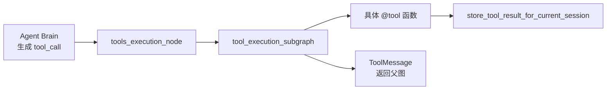

# 新增工具指南

## 1. 工具调用链路

新增工具前先理解调用链：



Brain 只生成结构化 tool call；Tools Node 和工具执行子图负责执行、失败分类、修复和最终 `ToolMessage`。

## 2. 最小新增步骤

### 2.1 新建工具函数

在 `app/tools/` 下新增文件，例如 `app/tools/weather.py`：

```python
from langchain_core.tools import tool

from app.config import PROMPTS
from app.logging_config import logger
from app.tools.storage import store_tool_result_for_current_session


@tool(description=PROMPTS["tools"]["get_weather"])
async def get_weather(location: str) -> str:
    logger.info("触发工具: 天气查询 -> %s", location)
    result = f"{location}: sunny"
    store_tool_result_for_current_session(
        "get_weather",
        result,
        {"location": location},
    )
    return result
```

要求：

- 使用 `@tool`。
- 参数尽量简单、明确、可 JSON 序列化。
- 返回字符串。
- 长输出写入工具结果归档，只把摘要返回给模型。

### 2.2 注册工具

修改 `app/tools/registry.py`：

```python
from app.tools.weather import get_weather

AGENT_TOOLS = [search_web, run_python, run_command, get_weather]
```

`AGENT_TOOLS` 是 Brain 绑定工具和工具执行子图查找工具的共同入口。

### 2.3 添加 prompt 描述

修改 `config/prompts.yaml`：

```yaml
tools:
  get_weather: |
    当需要查询指定地点天气时调用此工具。必须传入 location，例如 "Shanghai"。
```

工具描述会直接影响模型是否调用工具。描述要写清楚：

- 什么时候调用。
- 参数是什么。
- 不应该用它做什么。

## 3. 是否需要改工具执行子图

多数简单工具不需要改 `tool_execution_subgraph.py`。如果新工具有特殊失败模式，应补：

- `get_max_retries(tool_name)`：重试预算。
- `classify_tool_result(tool_name, result)`：失败分类。
- `validate_fixed_args()`：参数修复安全校验。

例子：一个 HTTP API 工具可能需要分类：

- 401/403：`terminal_failure`，改参数没用。
- 429：`terminal_failure` 或 `needs_external_action`，避免自动重试打爆限流。
- 400：`retryable_failure`，可能是参数格式错。

## 4. 结果归档约定

工具应调用：

```python
store_tool_result_for_current_session(tool_name, raw_output, metadata)
```

归档文件：

```text
.data/sessions/{session_id}/tool_results.json
```

推荐返回策略：

- 短输出：直接返回。
- 长输出：返回 `ref_id + 摘要`，完整内容存档，并提示 Agent 可用 `read_tool_result(ref_id="tool-xxxx")` 读取完整内容。
- 错误输出：也要存档，并在 metadata 中标记 `status: error`。

## 5. 错误返回约定

现有工具用字符串前缀让子图分类：

- `搜索失败: ...`
- `代码报错:\n...`
- `执行失败: ...`
- `命令超时...`

新增工具也应定义稳定错误格式，便于 `classify_tool_result()` 判断。不要只返回模糊的 `"error"`。

## 6. 安全边界

如果工具会产生副作用，例如写文件、发请求、安装依赖、删除资源，应考虑：

- 是否需要用户确认。
- 是否需要白名单。
- 是否需要在 `classify_tool_result()` 返回 `needs_external_action`。
- 是否禁止 LLM 参数修复扩大权限。

当前 `run_command` 只在“自动修复参数”阶段拦截危险命令；首次工具调用仍可能有副作用。新增高风险工具不应只依赖 prompt 约束。

## 7. 测试建议

新增工具至少补以下测试：

1. 工具成功返回，并写入当前 session。
2. Tools Node 能把 tool call 转成对应 `ToolMessage`。
3. 典型失败能被 `classify_tool_result()` 正确分类。
4. 如果支持自动修复，修复参数必须经过 schema 和安全校验。
5. 如果有副作用，测试危险参数会被拒绝或转成 `needs_external_action`。

测试位置优先：

- `tests/test_tool_execution_subgraph.py`
- 必要时新增 `tests/test_<tool_name>.py`

## 8. 新增工具检查清单

- [ ] 工具函数已实现为 async `@tool`。
- [ ] 工具参数清晰且可 JSON 序列化。
- [ ] 已注册到 `AGENT_TOOLS`。
- [ ] 已补 `config/prompts.yaml` 工具描述。
- [ ] 长输出和错误输出已归档。
- [ ] 特殊失败已加入 `classify_tool_result()`。
- [ ] 风险参数已加入 `validate_fixed_args()` 或工具自身校验。
- [ ] 已补测试。
- [ ] 已更新相关文档。
