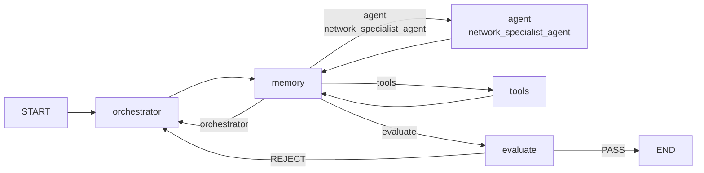

# 路由与状态图设计说明

## 1. 模块位置

主要文件：

- `app/cli.py`
- `app/nodes/memory_manager.py`
- `app/nodes/orchestrator.py`
- `app/nodes/evaluator.py`

路由分两层：

- LangGraph 主图结构在 `build_agent_graph()` 中定义。
- 运行时条件路由由 `route_after_memory()` 和 `route_after_evaluation()` 决定。

## 2. 主图结构



`build_agent_graph()` 的关键代码：

```python
workflow.add_edge(START, "orchestrator")
workflow.add_edge("orchestrator", "memory")
workflow.add_edge("agent", "memory")
workflow.add_edge("network_specialist_agent", "memory")
workflow.add_edge("tools", "memory")
workflow.add_conditional_edges("memory", route_after_memory, ...)
workflow.add_conditional_edges("evaluate", route_after_evaluation, ...)
```

设计初衷：所有可产生状态变化的节点都先回到 Memory Manager，由它统一固化 `world_state` 并决定下一跳。

## 3. 为什么 START 进入 Orchestrator

每轮用户输入都先进入 Orchestrator，而不是直接进入 Brain。原因是系统需要先判断：

- 这是简单问题还是复杂任务。
- 是否需要 todo list。
- 当前该加载哪些 `context_tags`。
- 如果这是上一轮质检打回，应如何更新计划。

例子：用户说“修复 bug 并验证”。如果直接给 Brain，模型可能马上读某个文件；如果先给 Orchestrator，它会建立“定位、修改、测试、总结”的计划，让后续节点有稳定目标。

## 4. `last_node` 的作用

`route_after_memory()` 不只看最后一条消息，还看 `state["last_node"]`。

原因是同样的消息类型在不同来源下含义不同：

| 来源 | 最后一条消息 | 正确下一跳 |
| --- | --- | --- |
| `agent` / `network_specialist_agent` | `AIMessage` 且有 `tool_calls` | `tools` |
| `agent` / `network_specialist_agent` | `AIMessage` 且无 `tool_calls` | `orchestrator` |
| `tools` | `ToolMessage` | `orchestrator` |
| `orchestrator` | 任意非最终可质检状态 | `agent` |

Evaluator 不再由 Memory Manager 直接进入。最终自然语言答复会先走 `agent/network_specialist_agent -> memory -> orchestrator`，随后由 Orchestrator 的条件边直接进入 `evaluate`，避免结束阶段出现 `orchestrator -> memory -> evaluate` 的重复 memory 节点。

如果没有 `last_node`，工具结果和普通用户消息都可能被错误送进 Agent 或 Evaluator。

## 5. Orchestrator 下一跳的二次校正

`orchestrator_node()` 会解析 LLM 输出中的 `next`，但代码最终会校正：

```python
default_next = default_orchestrator_next(state)
next_node = "evaluate" if default_next == "evaluate" else "agent"
```

`default_orchestrator_next()` 只在最后消息是“没有 tool_calls 的 AIMessage”时返回 `evaluate`。

设计意图：LLM 可以建议路由，但不能突破状态协议。新用户消息、工具结果、AI 工具调用都必须先回 Brain，而不是被质检器当作最终回答。

## 6. Evaluator 路由

`route_after_evaluation()` 很简单：

```python
if state["eval_status"] == "PASS":
    return "end"
return "orchestrator"
```

Evaluator 不直接回 Brain，而是回 Orchestrator。原因是打回后应该先更新 todo、记录阻塞原因或调整计划，再让 Brain 继续执行。

例子：Evaluator 认为“还有 pending 的测试步骤，但回答说已完成”。它会追加 `[质检打回]` 消息。Orchestrator 看到这条消息后，把测试 todo 改为 `in_progress` 或 `pending`，再让 Brain 调用命令验证。

## 7. CLI 与 Web 入口差异

CLI 和 Web 复用同一张图：

- CLI 使用 `agent_app.ainvoke()`，最终把最后一条 AI 消息追加回 `memory_messages`。
- Web 使用 `agent_app.astream(..., stream_mode="updates")`，把每个节点更新转成前端事件。

两者共享 `thread_id` checkpointer 和 `session_id` 存储隔离，但 Web 额外维护：

- `status`
- `current_node`
- `model_output`
- `tool_runs`
- `events`
- `world_state`

## 8. 路由设计的风险边界

- 路由依赖 `last_node`，所以每个节点返回时必须设置正确的 `last_node`。
- Tools Node 返回的是 `ToolMessage` 列表，必须保持 `tool_call_id` 与原始 tool call 对齐。
- Evaluator 打回会新增 `HumanMessage`，这会改变最后消息类型，因此下一轮必须从 Orchestrator 重新开始。
- Memory Manager 归档历史时要避免保留窗口以 `ToolMessage` 开头，否则会破坏工具调用邻接关系。
