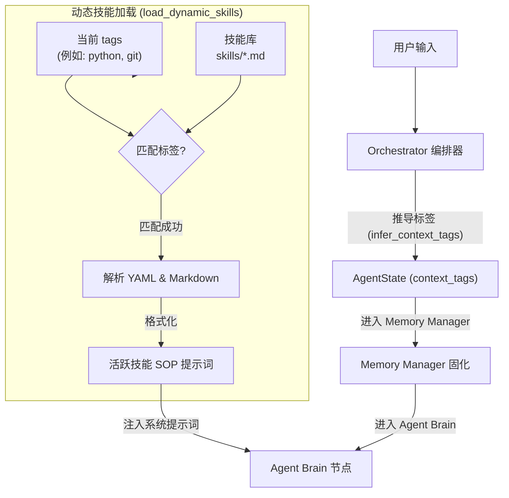

# Skill Mechanism (技能机制) 设计说明

## 1. 模块定位

主要文件：
- `skills/` (项目根目录下，存放技能 SOP Markdown 文件)
- `app/memory/store.py` (包含 `load_dynamic_skills` 技能扫描与加载器)
- `app/nodes/common.py` (在 `get_system_prompt` 中动态组装注入 prompt)
- `app/tools/skills.py` (提供 `save_skill_sop`、`list_skills`、`delete_skill_sop` 和 `get_skill_sop` 技能管理工具)
- `app/web_static/app.js` (前端时间轴与编号对齐机制)

技能机制是框架提供的一套**非执行的、流程指导性**的 Procedural Knowledge（标准操作规程，SOP）加载系统。

---

## 2. “技能 (Skill)” 与 “工具 (Tool)” 的区别

在智能体框架中，技能与工具是两个完全不同维度的能力集：

| 维度 | 工具 (Tool) | 技能 (Skill) |
| --- | --- | --- |
| **本质** | 动作与代码执行 (Actionable Code) | 指导与规程约束 (Procedural Instructions) |
| **实现方式** | 编写 Python 异步函数，修饰为 `@tool` | 编写带有 YAML frontmatter 的 Markdown SOP 文件 |
| **加载时机** | 静态绑定至大模型客户端，大模型通过 `tool_calls` 按需调用 | 框架检测当前 `context_tags`，自动加载并在进入 Agent Brain 阶段前注入 system prompt |
| **主要用途** | 读写文件、运行 Python、搜索网页、调用外部服务 | 指引 Agent 如何安全合理地进行排障、提 Commit、写代码或处理边界错误（提供思考规范） |
| **自我迭代** | 需要开发者修改代码文件，重新注册并重启系统 | Agent 运行期在发现好方案时，可自动调用 `save_skill_sop` 工具固化新 SOP，实现技能自演进 |

---

## 3. 技能加载与注入链路

下图展示了从用户输入、标签推导、技能匹配到最终 Prompt 注入的完整链路：



---

## 4. 技能文件格式 (Schema)

技能存放在 `skills/` 文件夹下，后缀为 `.md`。它必须以 `---` 包裹的 YAML frontmatter 作为元数据头部，以下是标准 Schema：

```markdown
---
name: 技能唯一标识符 (英文字母/数字/下划线/连字符)
description: 简短的技能描述，帮助展示与列出
tags: [关联标签1, 关联标签2, ...] (用于与运行期 context_tags 进行交集匹配)
---

# 技能标题

技能的详细步骤说明 (Markdown 格式)。
1. 第一步...
2. 第二步...
```

### 真实示例 1 (`skills/python_debug.md`)
```markdown
---
name: python_debug
description: Python code debugging and execution guidelines.
tags: [python, tool_error]
---

# Python Debugging SOP

When encountering Python errors or writing code, you MUST:
1. **Analyze Tracebacks**: Closely inspect Python runtime stack trace errors to identify syntax, type, or name mismatches.
2. **Validate Code**: Always test local edits by running test files using the command line (e.g. pytest) rather than assuming code runs cleanly.
3. **Handle Dependencies**: If a module is missing, suggest installation and seek confirmation before proceeding.
```

---

## 5. 技能管理工具

为了让 Agent 在运行期能够自主沉淀知识和查找已有规程，框架注册了两个技能管理工具：

### 5.1 `list_skills` (列出所有技能)
*   **用途**：大模型调用此工具获取当前系统中已保存的所有技能的名称、描述与对应标签。
*   **出参**：格式化后的技能摘要列表字符串。
*   **调用示例**：
    ```json
    {}
    ```
*   **返回示例**：
    ```text
    可用技能 SOP 列表:
    - **git_workflow**: Standard operating procedure for git commit and branch operations. (标签: ['git', 'command'])
    - **python_debug**: Python code debugging and execution guidelines. (标签: ['python', 'tool_error'])
    ```

### 5.2 `save_skill_sop` (保存/修改技能)
*   **用途**：当 Agent 决定沉淀技能、或用户明确指令“保存/更新某某规程为技能”时调用。此工具如果被传入已存在的技能 `name`，将自动覆写文件以实现技能修改/更新。
*   **总结与归纳机制**：在调用该工具前，Agent 必须根据最近的对话和任务/工具调用历史，总结提炼出用户在本次会话中完成的**最后一个完整的任务**（即使任务分了多个步骤，归纳也必须完整，包含该任务的全过程），并传入 `instructions` 参数。必须严格遵循以下原则：
    1. **提取最后一个完整任务**：如果用户在本次会话中做了两个相关性不强、或者没有依赖关系的事情，**必须且只能将“最近一个”完整的任务保存为 skill**，隔离并抛弃前面不相干的事项。
    2. **通用性与可复用性**：归纳的 skill 必须在一定程度上具备通用性。例如将具体任务的“查询深圳天气”抽象并保存为“查询某城市天气”的通用 SOP，而非特化硬编码为深圳。
    3. **固化成功步骤（排除失败探索）**：步骤中不应包含中间调试或失败的探索过程，而是应该直接把通过 web search 查询到的正确工具、网站、接口或命令等有效资源固化到 skill SOP 步骤中。
*   **入参**：
    *   `name` (str): 技能名称（必须匹配 `^[a-zA-Z0-9_-]+$` 以防止目录穿越攻击）。
    *   `description` (str): 技能功能简述。
    *   `tags` (list[str]): 关联的上下文匹配标签。
    *   `instructions` (str): 详细的步骤规程内容。
*   **调用示例**：
    ```json
    {
      "name": "docker_troubleshoot",
      "description": "Docker container and image troubleshooting guide",
      "tags": ["command", "tool_error"],
      "instructions": "1. 检查 Docker 守护进程状态：`docker info`\n2. 清理无用容器和缓存：`docker system prune -f`\n3. 查看最近失败容器的日志：`docker logs <container_id>`"
    }
    ```
*   **返回成功结果**：
    ```text
    成功: 技能 SOP 'docker_troubleshoot' 已保存至 /path/to/project/skills/docker_troubleshoot.md，标签: ['command', 'tool_error']。
    ```

### 5.3 `delete_skill_sop` (删除技能)
*   **用途**：当某项技能 SOP 已过时、被废弃、或用户明确要求删除特定技能时，Agent 可以调用此工具从磁盘中彻底物理删除对应的技能 Markdown 文件。
*   **入参**：
    *   `name` (str): 技能名称（需要匹配 `^[a-zA-Z0-9_-]+$` 以防目录穿越）。
*   **调用示例**：
    ```json
    {
      "name": "docker_troubleshoot"
    }
    ```
*   **返回成功结果**：
    ```text
    成功: 技能 SOP 'docker_troubleshoot' 已删除。
    ```

### 5.4 `get_skill_sop` (查看技能详情)
*   **用途**：当 Agent 需要查看某个具体技能的详细 SOP 规程内容、具体步骤和前置条件时调用。
*   **入参**：
    *   `name` (str): 技能名称（需要匹配 `^[a-zA-Z0-9_-]+$` 以防目录穿越）。
*   **调用示例**：
    ```json
    {
      "name": "docker_troubleshoot"
    }
    ```
*   **返回成功结果**：
    ```text
    ---
    name: docker_troubleshoot
    description: Docker container and image troubleshooting guide
    tags: [command, tool_error]
    ---

    1. 检查 Docker 守护进程状态：`docker info`
    2. 清理无用容器和缓存：`docker system prune -f`
    3. 查看最近失败容器的日志：`docker logs <container_id>`
    ```

---

## 6. WebUI 中的编号对齐保障

当引入新的技能管理工具后，在一次任务运行中，Agent 可能会频繁调用工具（例如查询、保存，或连续排障）。

在 WebUI 中，左侧为**事件日志 (Event Logs)**，右侧为**路由编排流程图 (Orchestration Flowchart)**。为防止多事件连续产生时出现编号断裂或不一致：

### 6.1 问题根源
原先的 `collectRouteTimeline` 在检测到连续的同类型事件（例如连续多次 Tool 开始、Tool 完成，它们的 targetNode 都是 `"tools"`）时，直接通过 `continue` 略过了后续事件的编号映射，导致后面的事件在日志中显示为空白编号，而流程图 edge 标签却照常累加，从而引发视觉和排版上的不一致。

### 6.2 解决方案
在 `app/web_static/app.js` 的 `collectRouteTimeline` 中：
当检测到新事件的 `targetNode` 与 `sequence` 尾部已激活节点一致时，**虽然不向 sequence 重复推送节点（保持流程图无冗余环）**，但是**依然将该事件的 ID 映射到当前的 sequence.length - 1 步数上**。

```javascript
    if (sequence[sequence.length - 1] === targetNode) {
      // 保持当前步骤编号，使本阶段内产生的 consecutive events 全部共享相同的 Step ID
      eventSteps.set(event.id || `${event.type}-${event.time}`, sequence.length - 1);
      continue;
    }
```
这样，如果 step 5 是 Tools 节点，在这一步里调用的 `list_skills` 的 `tool_start`、`tool_end` 和其他工具运行事件在左侧日志中都将清晰而稳定地标记为 `[5]`，完美与右侧流程图上的 `memory --(5)--> tools` 连线编号对齐。
