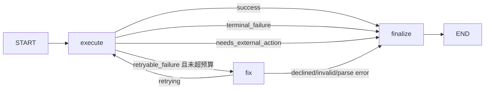

# Tools 与工具执行子图设计说明

## 1. 模块位置

主要文件：

- `app/tools/registry.py`
- `app/tools/search.py`
- `app/tools/webpage_reader.py`
- `app/tools/python_runner.py`
- `app/tools/command_runner.py`
- `app/tools/context.py`
- `app/tools/storage.py`
- `app/nodes/tools_node.py`
- `app/nodes/tool_execution_subgraph.py`
- `config/prompts.yaml` 的 `tools` 与 `tool_execution`

## 2. 工具层职责

工具层负责把模型的结构化 tool call 转成真实动作，并把输出归档。当前注册工具：

| 工具 | 文件 | 用途 |
| --- | --- | --- |
| `search_web(query)` | `app/tools/search.py` | 通过 Tavily 获取联网检索结果，最多 3 条摘要。 |
| `read_webpage(url, max_chars=2400, include_tables=False, headers=None)` | `app/tools/webpage_reader.py` | 读取 HTML 页面并提取正文，剔除 script/style/nav/footer/header/code/pre 等噪音和代码块，完整结果归档为引用。 |
| `list_tool_results(limit=10)` | `app/tools/tool_results.py` | 查看当前会话已归档工具结果引用。 |
| `read_tool_result(ref_id, offset=0, limit=8000)` | `app/tools/tool_results.py` | 按引用读取完整工具结果，支持分页。 |
| `start_sandbox()` | `app/tools/sandbox_tools.py` | 显式启动当前会话共享 Docker 容器。 |
| `sandbox_status()` | `app/tools/sandbox_tools.py` | 查看当前会话沙箱状态，不启动容器。 |
| `stop_sandbox()` | `app/tools/sandbox_tools.py` | 停止当前会话共享 Docker 容器。 |
| `add_shared_mount(name, host_path, access="read")` | `app/tools/sandbox_tools.py` | 为访问本地系统目录创建前端审批申请，支持 read (只读) 与 write (读写)；Windows 原生路径也走同一机制。 |
| `apply_sandbox_file(source_path, target_path, overwrite=False)` | `app/tools/sandbox_tools.py` | 为 `/workspace/work` 内的单个文件创建写回审批申请，目标支持 `repo://...` 和 `shared://<name>/...`。 |
| `run_python(code)` | `app/tools/python_runner.py` | 在当前会话 Docker 沙箱中执行 Python 代码。 |
| `run_command(command)` | `app/tools/command_runner.py` | 在当前会话 Docker 沙箱中执行 shell 命令。 |
| `save_skill_sop(name, description, tags, instructions)` | `app/tools/skills.py` | 保存或覆盖带 YAML frontmatter 的技能 SOP Markdown 文件。 |
| `list_skills()` | `app/tools/skills.py` | 列出当前技能库中的 SOP 名称、描述和标签。 |
| `get_skill_sop(name)` | `app/tools/skills.py` | 读取指定技能 SOP 的完整 Markdown 内容。 |
| `delete_skill_sop(name)` | `app/tools/skills.py` | 删除指定技能 SOP 文件。 |
| `api_request(url, method="GET", headers=None, data=None)` | `app/tools/api_request.py` | 直接调用 HTTP/HTTPS API、JSON/纯文本/非 HTML 资源或调试原始响应。禁止用于网页 HTML 主体；HTML 响应会被拒绝并提示使用 `read_webpage()`。 |

`AGENT_TOOLS` 是唯一注册表：

```python
AGENT_TOOLS = [search_web, read_webpage, start_sandbox, sandbox_status, stop_sandbox, add_shared_mount, apply_sandbox_file, list_tool_results, read_tool_result, run_python, run_command, save_skill_sop, list_skills, delete_skill_sop, get_skill_sop, api_request]
```

新增工具时至少要改三处：

1. 实现 `@tool` 函数。
2. 加入 `AGENT_TOOLS`。
3. 在 `config/prompts.yaml` 的 `tools` 下写清楚何时调用。

## 3. 父图 Tools Node

`tools_execution_node()` 做的是父图适配：

1. 从最后一条 AIMessage 读取 `tool_calls`。
2. 设置当前 `session_id`。
3. 对每个 tool call 调用 `tool_execution_subgraph`。
4. 只向父图返回 `ToolMessage` 列表。

它不会把子图内部的 `internal_messages` 暴露给主图。这样主图消息流保持干净，Brain 只看到最终工具结果。

## 4. 为什么需要工具执行子图

工具失败不是一种情况。比如：

- `run_python` 的 `NameError` 可能通过修代码重试。
- `run_python` 缺 `pandas` 不应该自动安装依赖。
- `search_web` 无结果可以改写 query。
- `search_web` 401/403 是配置问题，改 query 没用。
- `run_command` 拼错命令可以尝试修复。
- `run_command` 修复成 `rm -rf` 必须拒绝。

所以项目把“单个工具调用”建模成私有 LangGraph 子图：



## 5. `ToolExecutionState`

子图私有状态：

```python
class ToolExecutionState(TypedDict):
    original_request: dict[str, Any]
    tool_call_id: str
    tool_name: str
    args: dict[str, Any]
    session_id: str
    retry_count: int
    max_retries: int
    internal_messages: list[dict[str, Any]]
    status: str
    final_result: str
    last_result: NotRequired[str]
    last_error: NotRequired[str]
    failure_reason: NotRequired[str]
    fix_explanation: NotRequired[str]
    required_action: NotRequired[dict[str, Any]]
```

设计重点：

- `internal_messages` 记录每次执行和修复，但默认不进入父图。
- `required_action` 表示子图不能安全完成，需要主图或用户决定。
- `retry_count/max_retries` 防止无限修复。

## 6. 失败分类

`classify_tool_result()` 把工具输出分成：

- `success`：结果可用。
- `retryable_failure`：参数或代码可能可修复。
- `terminal_failure`：继续重试没有意义或风险过高。
- `needs_external_action`：需要外部动作，例如安装 Python 依赖。
- `unknown_tool`：工具名不在注册表里。

例子：

```text
代码报错:
ModuleNotFoundError: No module named 'pandas'
```

会被分类为 `needs_external_action`，最终结果会说明“工具子图不会自动调用 run_command 安装依赖”，并给出建议动作：

```json
{
  "type": "install_python_package",
  "package": "pandas",
  "suggested_tool": "run_command",
  "command": "pip install pandas",
  "requires_confirmation": true,
  "requires_sandbox": true
}
```

## 7. 参数修复

`fix_node()` 调用 LLM 只做参数修复，要求输出 JSON：

```json
{
  "can_retry": true,
  "args": {"code": "print(1)"},
  "reason": "补充可执行代码"
}
```

修复后还会经过 `validate_fixed_args()`：

- 必须符合工具 schema。
- 不能改工具名。
- `run_command` 不能包含危险模式。
- 修复后的命令风险不能高于原始命令。

例如原始命令是 `cat missing-file`，修复器提出 `rm -rf /tmp/demo`，会被拒绝，因为风险升级且匹配危险命令模式。

## 8. 工具输出归档

工具内部通过 `store_tool_result_for_current_session()` 写入：

```text
.data/sessions/{session_id}/tool_results.json
```

如果输出超过 1024 字符，工具返回引用和摘要，完整内容存档。这样避免长输出反复污染模型上下文。

`read_webpage()` 的输出策略更严格：

- 返回标题、描述、提取器、正文长度、主要标题和受 `max_chars` 限制的正文预览。
- 完整提取结果以 JSON 存入 `tool_results.json`，包含 URL、状态码、content-type、metadata 和正文。
- 如果模型需要继续阅读，必须通过 `read_tool_result(ref_id, offset, limit)` 分页读取，不要重新用 `api_request` 拉整页 HTML。
- 主提取器是 `trafilatura`；未安装时自动使用内置 HTML parser fallback。

`api_request()` 有硬性边界：当 GET 响应是 `text/html`、`application/xhtml+xml`，或内容看起来是 HTML 文档时，不返回也不归档 HTML 主体，只返回错误提示并要求改用 `read_webpage()`。这样避免网页源码进入 LLM 上下文。

当工具返回类似：

```text
命令输出过长，已保存为引用 tool-0001。
```

Agent 应优先调用：

```text
read_tool_result(ref_id="tool-0001")
```

如果归档内容仍很长，使用 `offset` 和 `limit` 分页读取，而不是重新执行 `head`、`tail` 或缩小版命令。`list_tool_results()` 可用于查看当前会话已有引用。

## 9. 安全注意事项

早期版本的 `run_command` 曾直接在 host 上使用：

```python
subprocess.run(command, shell=True, timeout=30)
```

这不是系统级沙箱。当前 Agent 命令、Python 执行以及网络请求（api_request）均必须进入 Docker 会话沙箱，不允许且不提供在宿主机上执行的任何降级通道或开关。第一阶段 Docker 会话沙箱路径：

```text
.data/sessions/{session_id}/sandbox_work/shared -> /workspace/work:rw
```

Docker 沙箱按 `session_id` 懒启动一个常驻容器。同一会话内的 `run_command` and `run_python` 都通过 `docker exec` 进入同一个容器，所有节点都可以通过 `.data/sessions/{session_id}/sandbox.json` 和共享工作目录看到容器 environment 与产物。

沙箱状态进入 `world_state["sandbox"]`，并会在已有 metadata 时通过 `docker inspect` 做真实健康检查。Agent 也可以显式调用 `sandbox_status()` 查看状态。

共享目录在容器内默认只读。如果显式指定 `access="write"`，则可以申请读写权限（挂载为 `rw`）。若需要把沙箱产物写回，可操作已获得读写授权的挂载，或者在 `/workspace/work` 中生成文件再调用 `apply_sandbox_file()` 创建审批申请。目标支持 `repo://path/to/file` 和 `shared://<name>/path/to/file`；不带 scheme 时按 `repo://` 处理。该工具只支持单文件申请，拒绝路径穿越、`.git`、`.data` 和 `.env` 目标，默认不允许覆盖已有文件。`shared://` 目标必须先通过 `add_shared_mount()` 创建审批申请，并由用户批准后写入当前 session 的 `shared_mounts.json` 授权表。

当任一工具创建 pending approval 后，Web run 会进入 `awaiting_approval`，停止继续编排；用户在前端批准或拒绝后，后端会追加审批结果消息并继续运行。

Windows 原生目录不需要新协议。用户授权后仍然映射到 `/workspace/shared/<name>`：

```text
C:\Users\alice\Documents\docs -> /workspace/shared/docs:ro (或 :rw)
```

Agent 读取 `/workspace/shared/docs`，修改版写到 `/workspace/work`，再申请 `shared://docs/...` 写回。敏感目录会被拒绝，包括 `AppData`、`Windows`、`Program Files`、`ProgramData`、`.ssh`、`.aws`、`.azure`、`.kube`。

真正的写回只由 Web 审批 API 执行：

```text
POST /api/approvals/approve
POST /api/approvals/reject
```

待审批记录保存在 `.data/sessions/{session_id}/approvals.json`，并进入 `world_state["pending_approvals"]` 供前端和 Agent 观察。

Docker 沙箱默认开启网络，使用非 root 用户、只读根文件系统、`/tmp` tmpfs、CPU/内存/pids/超时限制。生产环境还应增加：

- 命令白名单或审批层。
- 工作目录限制。
- 文件系统沙箱。
- 网络访问策略。
- 对写操作、安装依赖、删除文件等动作的用户确认。

工具子图的设计已经为这些策略预留了接口：`needs_external_action` 和 `required_action`。
