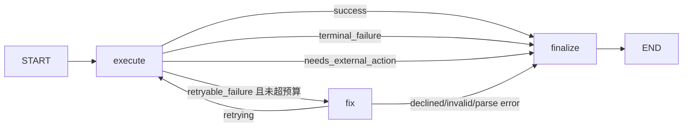

# Tools 与工具执行子图设计说明

## 1. 模块位置

主要文件：

- `app/tools/registry.py`
- `app/tools/search.py`
- `app/tools/python_runner.py`
- `app/tools/command_runner.py`
- `app/tools/context.py`
- `app/tools/storage.py`
- `app/nodes/tools_node.py`
- `app/nodes/tool_execution_subgraph.py`
- `config/prompts.yaml` 的 `tools` 与 `tool_execution`

## 2. 工具层职责

工具层负责把模型的结构化 tool call 转成真实动作，并把输出归档。当前注册工具：

| 工具 | 文件 | 用途 |
| --- | --- | --- |
| `search_web(query)` | `app/tools/search.py` | 通过 Tavily 获取联网检索结果，最多 3 条摘要。 |
| `run_python(code)` | `app/tools/python_runner.py` | 在当前 Python 进程中执行代码，适合计算和数据处理。 |
| `run_command(command)` | `app/tools/command_runner.py` | 通过 shell 执行系统命令，返回 stdout/stderr。 |

`AGENT_TOOLS` 是唯一注册表：

```python
AGENT_TOOLS = [search_web, run_python, run_command]
```

新增工具时至少要改三处：

1. 实现 `@tool` 函数。
2. 加入 `AGENT_TOOLS`。
3. 在 `config/prompts.yaml` 的 `tools` 下写清楚何时调用。

## 3. 父图 Tools Node

`tools_execution_node()` 做的是父图适配：

1. 从最后一条 AIMessage 读取 `tool_calls`。
2. 设置当前 `session_id`。
3. 对每个 tool call 调用 `tool_execution_subgraph`。
4. 只向父图返回 `ToolMessage` 列表。

它不会把子图内部的 `internal_messages` 暴露给主图。这样主图消息流保持干净，Brain 只看到最终工具结果。

## 4. 为什么需要工具执行子图

工具失败不是一种情况。比如：

- `run_python` 的 `NameError` 可能通过修代码重试。
- `run_python` 缺 `pandas` 不应该自动安装依赖。
- `search_web` 无结果可以改写 query。
- `search_web` 401/403 是配置问题，改 query 没用。
- `run_command` 拼错命令可以尝试修复。
- `run_command` 修复成 `rm -rf` 必须拒绝。

所以项目把“单个工具调用”建模成私有 LangGraph 子图：



## 5. `ToolExecutionState`

子图私有状态：

```python
class ToolExecutionState(TypedDict):
    original_request: dict[str, Any]
    tool_call_id: str
    tool_name: str
    args: dict[str, Any]
    session_id: str
    retry_count: int
    max_retries: int
    internal_messages: list[dict[str, Any]]
    status: str
    final_result: str
    last_result: NotRequired[str]
    last_error: NotRequired[str]
    failure_reason: NotRequired[str]
    fix_explanation: NotRequired[str]
    required_action: NotRequired[dict[str, Any]]
```

设计重点：

- `internal_messages` 记录每次执行和修复，但默认不进入父图。
- `required_action` 表示子图不能安全完成，需要主图或用户决定。
- `retry_count/max_retries` 防止无限修复。

## 6. 失败分类

`classify_tool_result()` 把工具输出分成：

- `success`：结果可用。
- `retryable_failure`：参数或代码可能可修复。
- `terminal_failure`：继续重试没有意义或风险过高。
- `needs_external_action`：需要外部动作，例如安装 Python 依赖。
- `unknown_tool`：工具名不在注册表里。

例子：

```text
代码报错:
ModuleNotFoundError: No module named 'pandas'
```

会被分类为 `needs_external_action`，最终结果会说明“工具子图不会自动调用 run_command 安装依赖”，并给出建议动作：

```json
{
  "type": "install_python_package",
  "package": "pandas",
  "suggested_tool": "run_command",
  "command": "pip install pandas",
  "requires_confirmation": true,
  "requires_sandbox": true
}
```

## 7. 参数修复

`fix_node()` 调用 LLM 只做参数修复，要求输出 JSON：

```json
{
  "can_retry": true,
  "args": {"code": "print(1)"},
  "reason": "补充可执行代码"
}
```

修复后还会经过 `validate_fixed_args()`：

- 必须符合工具 schema。
- 不能改工具名。
- `run_command` 不能包含危险模式。
- 修复后的命令风险不能高于原始命令。

例如原始命令是 `cat missing-file`，修复器提出 `rm -rf /tmp/demo`，会被拒绝，因为风险升级且匹配危险命令模式。

## 8. 工具输出归档

工具内部通过 `store_tool_result_for_current_session()` 写入：

```text
.data/sessions/{session_id}/tool_results.json
```

如果输出超过 1024 字符，工具返回引用和摘要，完整内容存档。这样避免长输出反复污染模型上下文。

## 9. 安全注意事项

当前 `run_command` 使用：

```python
subprocess.run(command, shell=True, timeout=30)
```

这不是系统级沙箱。项目只在自动修复阶段做危险命令拦截，并不阻止 Brain 首次请求一个有副作用的命令。生产环境应增加：

- 命令白名单或审批层。
- 工作目录限制。
- 文件系统沙箱。
- 网络访问策略。
- 对写操作、安装依赖、删除文件等动作的用户确认。

工具子图的设计已经为这些策略预留了接口：`needs_external_action` 和 `required_action`。
